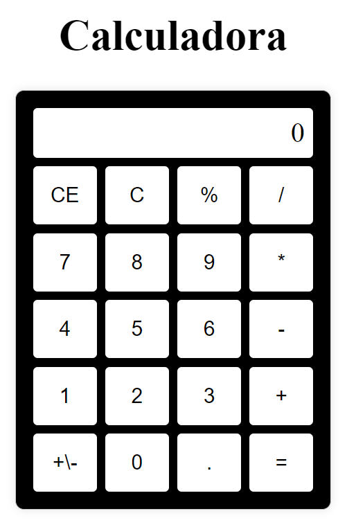

# 🧮 Calculadora

Uma simples calculadora desenvolvida em HTML, CSS e JavaScript.

## 📜 Descrição do Projeto

Este projeto é uma calculadora que permite realizar operações matemáticas básicas como adição, subtração, multiplicação e divisão. A interface é simples e intuitiva, ideal para praticar suas habilidades de programação.

## 🚀 Tecnologias Utilizadas

- HTML
- CSS
- JavaScript

## 📁 Estrutura do Projeto

- index.html
- styles.css
- script.js

## 🎯 Funcionalidades

- Realizar operações matemáticas básicas.
- Mostrar o resultado na tela.
- Limpar a tela com o botão **CE**.

### 📷 Demonstração

### 🔗 Link para o Projeto

👉 [Ver Projeto ao Vivo](https://maike-simoncini.github.io/Calculadora/) 👈

### 📄 Licença

Este projeto é de código aberto e pode ser utilizado por qualquer pessoa.

© 2023 Dev. Excelente
